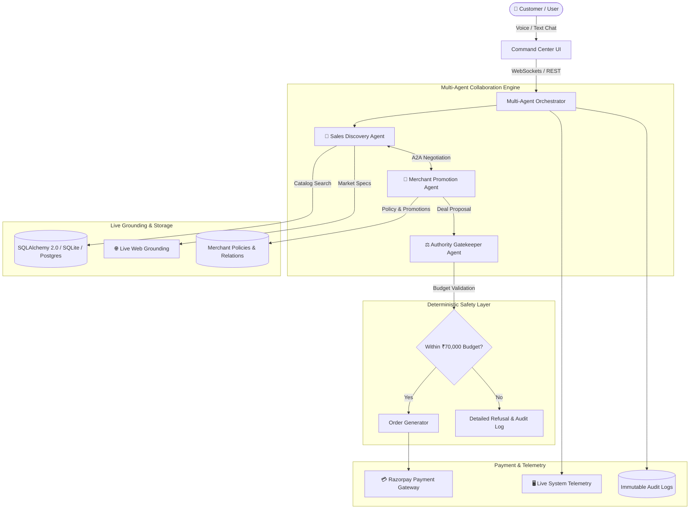

# AgentPay — Intelligent Multi-Agent Commerce Command Center

> **Autonomous AI-Powered Commerce Platform with Real-Time Agent-to-Agent (A2A) Negotiation, Live Web Search Grounding, Deterministic Safety Enforcement, Two-Way Voice Engine, and an Interactive 2D Phaser.js Office Simulation.**

[](https://fastapi.tiangolo.com/)
[](https://reactjs.org/)
[](https://phaser.io/)
[](https://ai.google.dev/)
[](https://razorpay.com/)

---

## 🌟 Key Highlights & Innovations

1. **Multi-Agent Collaborative Brain (A2A Protocol)**:
   - **Sales Discovery Agent (Michael)**: Understands customer requirements, searches catalog products, and leverages live web search for market comparisons.
   - **Merchant Promotion Agent (TechStore)**: Evaluates real-time inventory, bundle discounts, and upsell relation graphs.
   - **Authority Gatekeeper Agent**: Deterministically evaluates hard financial limits (customer budget caps, merchant policy rules) with **zero LLM hallucination risk**.
   - **Inter-Agent Dialogue**: Agents converse and negotiate with each other in real-time (`[Sales ➔ Merchant]`, `[Merchant ➔ Sales]`) before delivering cohesive recommendations.

2. **Interactive 2D Pixel Office (Phaser.js 3)**:
   - Custom canvas rendering of conference rooms, dual-monitor workstations, server rooms with blinking LEDs, water coolers, and potted plants.
   - 5 Animated pixel characters (*Customer*, *Sales Agent*, *Merchant Agent*, *Authority Agent*, *Merchant Admin*).
   - Dynamic speech bubbles popping up above characters during live multi-agent collaboration.

3. **Two-Way Voice Engine**:
   - **Speech-to-Text (STT)**: Built-in microphone input (`🎙️`) via Web Speech API allowing hands-free voice shopping.
   - **Text-to-Speech (TTS)**: Neural browser voice playback speaking agent recommendations aloud.

4. **Live Web Search Grounding**:
   - Real-time web search tool queries current tech specs, benchmarks, and external market pricing for accurate comparisons.

5. **Enterprise Telemetry & Immutable Audit Trail**:
   - 6 retro-cream status cards displaying live task queues, CPU/memory gauges, and service health LEDs.
   - Every single agent decision, transaction check, and policy evaluation is recorded in an immutable append-only audit log.

---

## 🏗️ System Architecture



---

## 💻 Tech Stack

### **Frontend**
- **Core**: React 18, TypeScript, HTML5, CSS3
- **2D Game Engine**: Phaser.js 3 (Custom procedural office canvas & character animations)
- **Networking**: WebSockets, Axios
- **Icons & UI**: Lucide React, Tailwind-inspired utility CSS
- **Voice**: Web Speech API (SpeechRecognition + SpeechSynthesis)
- **Build Tool**: Vite 6

### **Backend**
- **Framework**: FastAPI (Python 3.11+ / 3.13)
- **AI Brain**: Google Gemini 1.5 Flash via `google-genai` SDK
- **Database & ORM**: SQLAlchemy 2.0 (Async), SQLite (`aiosqlite`) / PostgreSQL (Neon Serverless)
- **Database Migrations**: Alembic
- **Web Grounding**: BeautifulSoup4, HTTPX
- **Payments**: Razorpay Python SDK

---

## 📁 Repository Structure

```text
Hackathon/
├── backend/
│   ├── app/
│   │   ├── agents/
│   │   │   ├── authority_agent.py   # Deterministic safety gatekeeper
│   │   │   ├── merchant_agent.py    # Promotions & upsell engine
│   │   │   ├── orchestrator.py      # Central router & A2A protocol
│   │   │   ├── sales_agent.py       # Customer discovery & cart sync
│   │   │   ├── tools.py             # Pure async DB tool functions
│   │   │   └── web_search.py        # Live web grounding tool
│   │   ├── api/routes/
│   │   │   ├── agent.py             # Session, chat, and status endpoints
│   │   │   ├── payments.py          # Razorpay order generation & webhooks
│   │   │   └── products.py          # Catalog listing & search
│   │   ├── core/
│   │   │   └── config.py            # Pydantic environment configuration
│   │   ├── db/
│   │   │   ├── models/              # All 15 SQLAlchemy ORM models
│   │   │   ├── base.py              # DeclarativeBase definition
│   │   │   ├── session.py           # Async engine & session factory
│   │   │   └── types.py             # Cross-platform JSONB/UUID types
│   │   └── main.py                  # FastAPI app & WebSocket mount
│   ├── scripts/
│   │   └── seed.py                  # Comprehensive demo catalog seeder
│   ├── requirements.txt             # Python dependencies
│   ├── .env.example                 # Public environment template
│   └── .env                         # Local runtime credentials (ignored)
├── frontend/
│   ├── src/
│   │   ├── components/
│   │   │   ├── BottomTelemetryBar.tsx  # 6 Retro-cream status cards
│   │   │   ├── CommandCenter.tsx       # Multi-tab command terminal & chat
│   │   │   ├── PhaserOffice.tsx        # React wrapper for Phaser canvas
│   │   │   └── TopBar.tsx              # Header with session badges & clock
│   │   ├── phaser/
│   │   │   └── OfficeScene.ts          # 2D pixel office simulation
│   │   ├── services/
│   │   │   ├── api.ts                  # Axios API client
│   │   │   └── voice.ts                # Two-way STT / TTS voice engine
│   │   ├── types/
│   │   │   └── index.ts                # TypeScript interface definitions
│   │   ├── App.tsx                     # Main layout coordinator
│   │   ├── main.tsx                    # React mount entry point
│   │   └── index.css                   # Global styles & typography
│   ├── index.html                      # Vite template
│   ├── package.json                    # Node dependencies
│   ├── tsconfig.json                   # TypeScript configuration
│   └── vite.config.ts                  # Vite server & proxy settings
└── README.md                           # Documentation
```

---

## ⚡ Quickstart Guide

### 1. Backend Setup

```bash
# Navigate to backend
cd backend

# Create and activate virtual environment
python -m venv venv
venv\Scripts\activate      # Windows
# source venv/bin/activate # macOS/Linux

# Install dependencies
pip install -r requirements.txt

# Configure environment variables
# Copy .env.example to .env and add your GEMINI_API_KEY
copy .env.example .env

# Seed the database with demo products, policies, and users
python scripts/seed.py

# Start the FastAPI backend server
python -m uvicorn app.main:app --host 0.0.0.0 --port 8000
```

### 2. Frontend Setup

```bash
# Navigate to frontend
cd frontend

# Install npm dependencies
npm install

# Build the React production bundle
npm run build

# Or start the Vite development server with hot-reload
npm run dev
```

### 3. Open in Browser
Open your browser and navigate to:
👉 **[http://localhost:8000/](http://localhost:8000/)** *(or [http://localhost:5173/](http://localhost:5173/) in Vite dev mode)*

---

## 🎯 Pre-Seeded Demo Scenarios

| Scenario | Action / User Prompt | Expected Agent Behavior |
|---|---|---|
| **1. Natural Language Search** | *"Show me some good laptops under 70000"* | **Sales Agent** finds Lenovo IdeaPad Slim 5 (₹62,000) & HP Pavilion 15 (₹67,000). |
| **2. Cart Sync & Cross-Sell** | Click on **Lenovo IdeaPad Slim 5** or say *"Add Lenovo IdeaPad to my cart"* | **Sales Agent** adds item; **Merchant Agent** initiates A2A dialogue offering bundle discount on USB Optical Mouse & Laptop Bag. |
| **3. Live Web Grounding** | *"Search the web for latest lightweight ultrabooks 2026"* | **Sales Agent** executes live web search and returns external market sources & benchmarks. |
| **4. Budget Approval & Payment** | Say *"Proceed to checkout"* (Cart total ₹62,000) | **Authority Agent** validates ₹62,000 <= ₹70,000 budget cap ➔ **APPROVED** ➔ Unlocks **💳 Razorpay Payment Button**. |
| **5. Policy Enforcement (Budget Rejection)** | Add **Dell Inspiron 15** (₹72,000) & say *"Proceed to checkout"* | **Authority Agent** catches ₹72,000 > ₹70,000 budget cap ➔ **REJECTED** with detailed explanation and audit record. |
| **6. Two-Way Voice Experience** | Click **`🎙️` Microphone** and speak your query | Transcribes speech to text in real-time and speaks responses aloud with neural TTS. |

---

## 🛡️ Deterministic Safety Rules

The **Authority Agent** executes strict policy logic in pure Python without LLM hallucination:

1. **`agent_purchase_enabled`**: Master kill switch allowing/disallowing AI autonomous purchases.
2. **`minimum_order_amount`**: Enforces minimum cart threshold (e.g., ₹500).
3. **`max_transaction_amount`**: Strict merchant upper transaction limit (e.g., ₹100,000).
4. **`max_discount_percentage`**: Caps promotional discounts (max 5.0%).
5. **`customer_budget_limit`**: Protects customer financial safety against personal budget cap (e.g., ₹70,000).

---

## 👥 Contributors & Hackathon Submission
- **Project**: AgentPay Command Center
- **Repository**: [https://github.com/kingping77777/fegesg](https://github.com/kingping77777/fegesg)
- **License**: MIT
